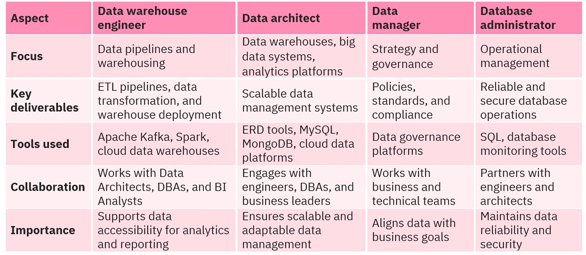

* Data warehouse engineers
* Data architects
* Data managers
* Database administrators

# Data Warehouse Engineers

Data warehouse engineers design, build and maintain data warehouses to store and analyze large datasets for business intelligence and reporting purposes. 

Data warehouse engineers develop extract, transform and load (**ETL**) processes for efficient data integration and management.

As data architectures evolves to include big data systems, the role of warehouse engineers also expands to include implement lakes for unstructured data which allows organizations to store and process diverse data types for advanced analytics and machine learning applications.

The responsibilities mentioned above describe the role of an ETL developer rather than a generic data warehouse engineer.

# Data Architect: The system designer

Data architects design the overall architecture for an organization's data management system encompassing data warehousing, big data and analytics platforms.

They define strategies for data integration, governance and security while ensuring scalability and high performance.

Their role also involves establishing schemas, indexing methods and partitioning strategies to optimize data retrieval.

Also, they model data relationships and design scalable solutions for high availability and outline disaster recovery strategies to safeguard critical information.

They also plan for future growth and technological advancements, making sure the system remains adaptable over time.

# Data Managers: The strategic overseer

Data managers are responsible for overseeing the governance and strategy of an organizations data. They ensure a data's quality, compliance and accessibility meet both business and regulatory standards.

Key tasks include developing data governance frameworks, enforcing adherence to established standards, defining access control policies, work on cross-departmental collaboration to align data usage with the organization's objectives and cultivating a culture of data literacy.

# Database Administrator: The operational gatekeeper

Database Administrators (**DBA**) are responsible for ensuring the smooth operation of databases.

They focus on security, availability and optimizing performance.

Their duties include conducting routine backups, optimizing performances and managing patches to address security concerns

They actively monitor database activity to identify and resolve issues, such as sluggish queries or unauthorized access

Also, they implement encryption protocols and maintain audit logs to uphold compliance requirements.

# All four roles in an example

Within a hospital network:
 
1. A data warehouse engineer designs and maintains a data warehouse that ensures efficient storage and retrieval of patient information from sources such as electronic health recodes, EHR and lab systems. They develop ETL process to transform and load data into structed format, allowing secure and efficient access for analytics and reporting.

2. A data architect develops scalable structure to store millions of patient records, facilitating rapid retrieval and secure access for authorized users. They design indexing strategies for quick searches of medical histories and prescriptions while planning for future system growth with emerging technologies.

3. A data manager is responsible for adherence to healthcare regulations. The data manager establishes access policies, supervisees data quality assurances and collaborates with medical researchers to enable data driver clinical practices. They also ensure IT operations are aligned with the organization's clinical and operational objectives.

4. A database administrator endures the uninterrupted operation of the the EHR system, conducts regular backups and addresses performance bottlenecks. They oversee user access to safeguard patient information and implement disaster recovery protocols to prevent data loss.

# Comparing the Roles

Together, these roles from an essential framework for managing and leveraging data effectively in any organizations.

# The Interconnections

Even though each role is unique, it's often pioneers of these roles will collaborate.

* Data warehouse engineers will coordinate with data architects to bring data warehouse designs and deployments to life. And with data managers, they coordinate with them to ensure the data pipelines adhere to governance requirements

* Data architects will team up with data warehouse engineers to ensure smooth implementation of database systems.

* Database administrators draw on data architects' expertise for system design and partner with data managers to uphold compliance and regularity standards